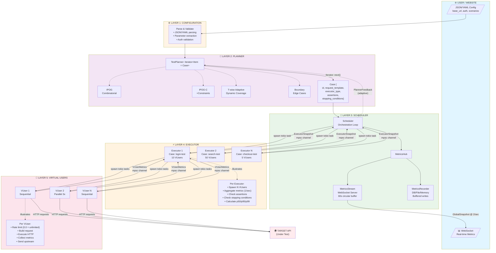
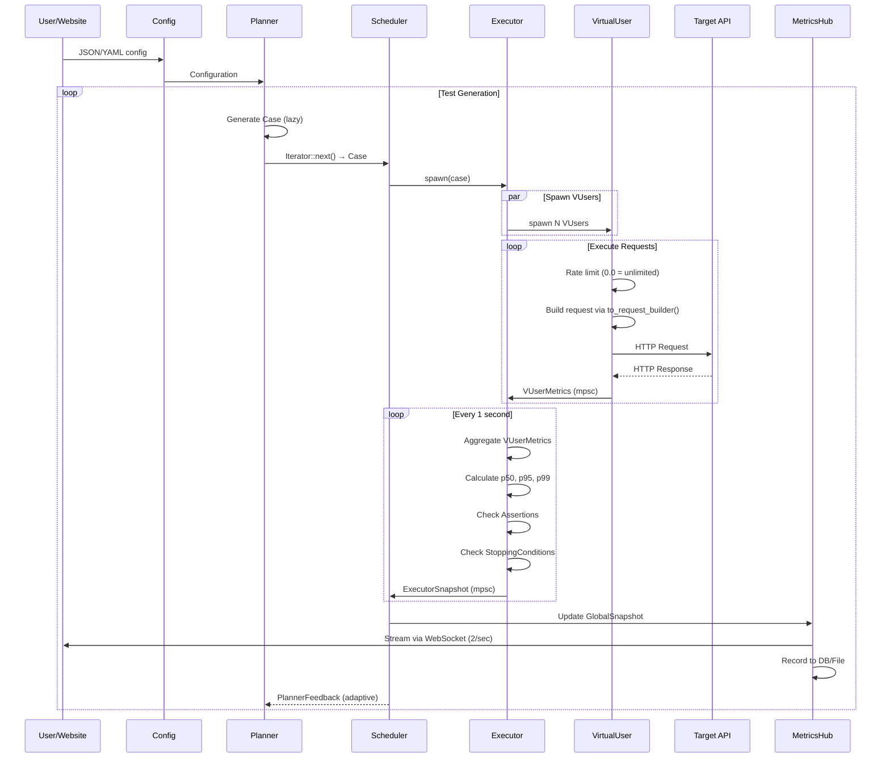
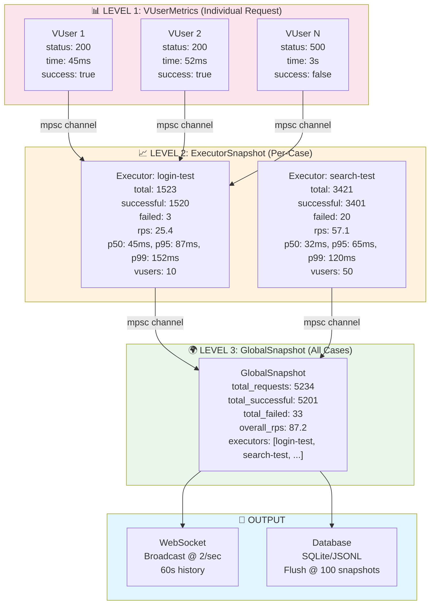
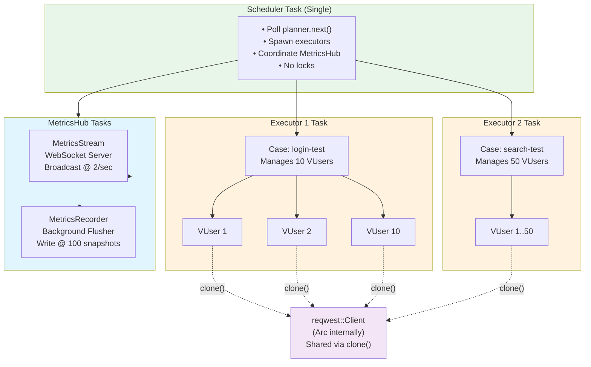
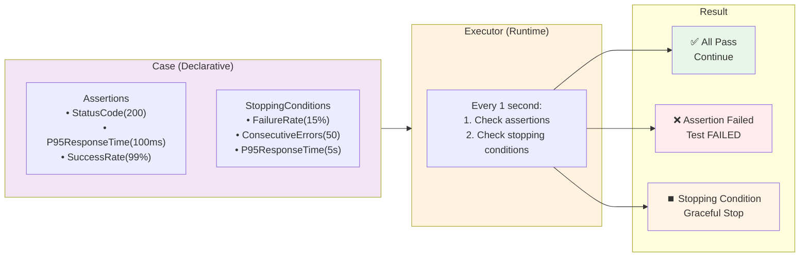
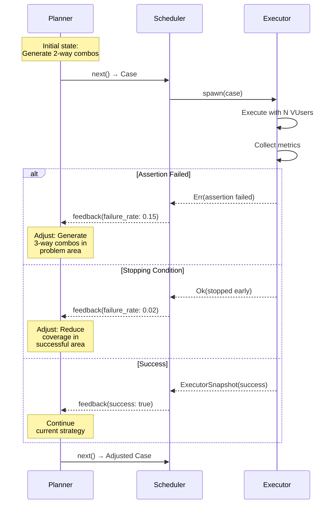
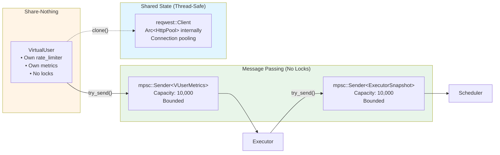
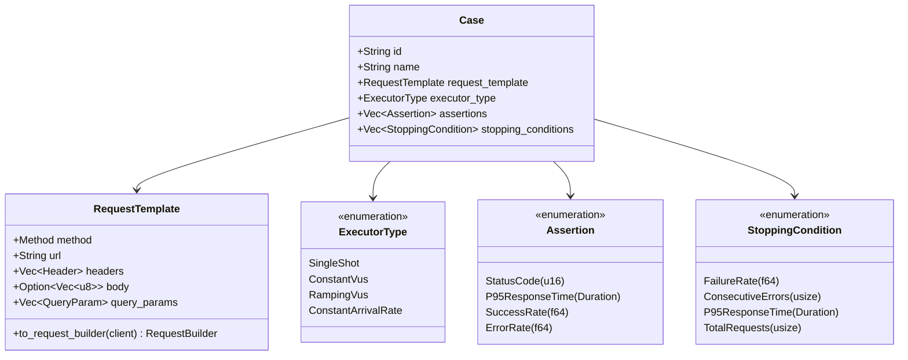
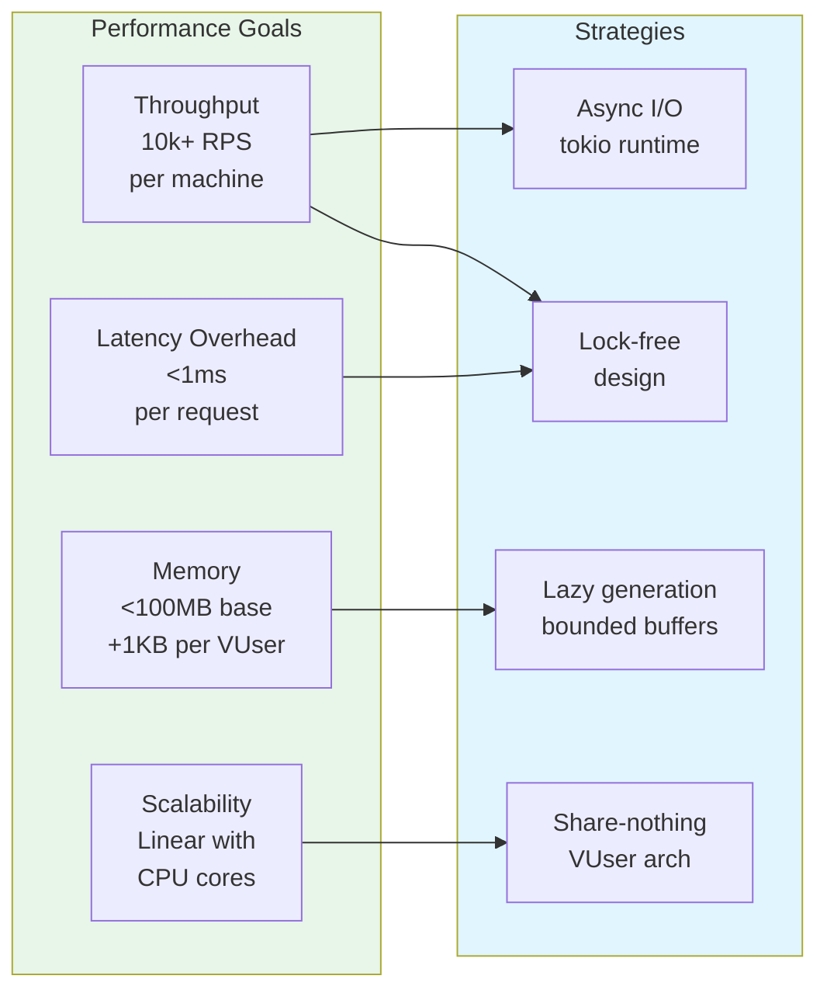

# Elerem Fuzzer - Mermaid Architecture Diagrams

## Complete System Architecture



---

## Data Flow & Sequence



---

## Metrics Aggregation Hierarchy



---

## Concurrency Model



---

## Validation Flow



---

## Feedback Loop (Adaptive Planning)



---

## Component Communication



---

## Test Case Structure



---

## Key Optimizations

```mermaid
mindmap
  root((Optimizations))
    No Arc Wrapper
      reqwest::Client has Arc internally
      Just clone() it directly
    Branch-Free Rate Limiting
      RateLimiter always present
      0.0 = unlimited
      No Option branching
    Parallel Requests
      Each VUser spawns N concurrent
      Higher throughput
      Configurable per VUser
    Request Template Caching
      to_request_builder() method
      Pre-build once
      Reuse many times
    Bounded Channels
      10k capacity limit
      Prevent memory explosion
      Non-blocking try_send()
    Lock-Free Architecture
      Zero mutexes
      Zero RwLocks
      Pure message passing
      Share-nothing VUsers
```

---

## Performance Targets



---

These Mermaid diagrams provide interactive, visual representations of the Elerem Fuzzer architecture that can be rendered in GitHub, documentation sites, or any Markdown viewer that supports Mermaid syntax.
